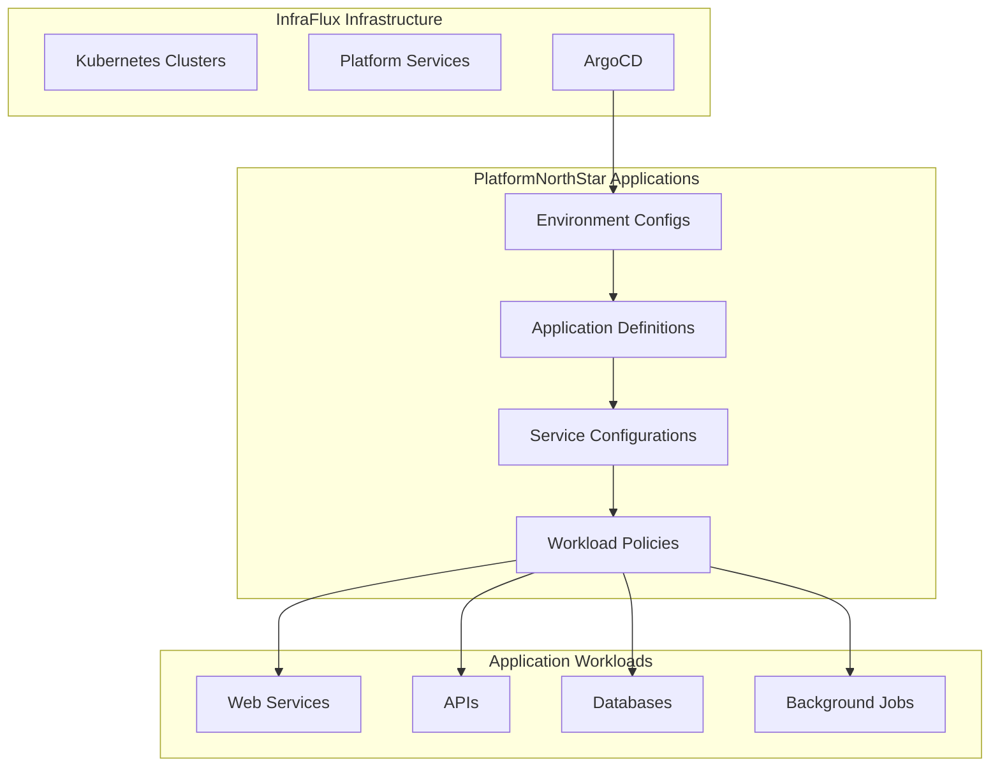

# PlatformNorthStar

## Application Platform Repository

This repository contains all application workloads, services, and configurations that run on the InfraFlux infrastructure platform. It follows GitOps principles for declarative application management.

## Architecture

PlatformNorthStar is designed to consume the infrastructure provided by InfraFlux and deploy applications in a structured, environment-aware manner.



## Repository Structure

```text
PlatformNorthStar/
├── environments/
│   ├── dev/
│   │   ├── applications/
│   │   ├── config/
│   │   └── values/
│   ├── staging/
│   │   ├── applications/
│   │   ├── config/
│   │   └── values/
│   └── prod/
│       ├── applications/
│       ├── config/
│       └── values/
├── applications/
│   ├── web-services/
│   ├── apis/
│   ├── databases/
│   └── background-jobs/
├── charts/
│   ├── app-template/
│   ├── database-template/
│   └── service-template/
├── policies/
│   ├── security/
│   ├── networking/
│   └── resource-limits/
├── config/
│   ├── defaults/
│   └── overlays/
└── docs/
    ├── deployment.md
    ├── configuration.md
    └── troubleshooting.md
```

## Key Principles

1. **Environment Separation**: Each environment has its own configuration
2. **Template-Based**: Reusable Helm charts for common application patterns
3. **Policy-Driven**: Security and resource policies applied consistently
4. **GitOps Native**: All changes flow through Git and ArgoCD
5. **Configuration Driven**: Easy to configure and customize applications

## Environment Progression

Applications follow a promotion pipeline:

```
Development → Staging → Production
```

- **Development**: Latest features, relaxed policies, quick iteration
- **Staging**: Production-like environment for testing and validation
- **Production**: Stable, secure, monitored production workloads

## Application Categories

### Web Services
- Frontend applications
- Static websites
- Single-page applications (SPAs)
- Progressive web apps (PWAs)

### APIs
- REST APIs
- GraphQL services
- Microservices
- Service meshes

### Databases
- PostgreSQL clusters
- Redis instances
- ClickHouse analytics
- Vector databases

### Background Jobs
- Scheduled tasks
- Event processors
- Data pipelines
- ML workflows

## Configuration Management

### Hierarchical Configuration
1. **Global Defaults**: Base configurations for all applications
2. **Environment Overrides**: Environment-specific settings
3. **Application Overrides**: Application-specific configurations
4. **Instance Overrides**: Individual instance customizations

### Configuration Sources
- **YAML Files**: Primary configuration format
- **Helm Values**: Template-based configurations
- **ConfigMaps**: Runtime configurations
- **Secrets**: Sensitive application data

## Deployment Patterns

### Blue-Green Deployments
Zero-downtime deployments with instant rollback capability.

### Canary Deployments
Gradual rollout with traffic splitting and automatic rollback.

### Rolling Updates
Sequential pod replacement with health checks.

### Feature Flags
Runtime feature toggles without deployments.

## Monitoring and Observability

### Application Metrics
- Business metrics and KPIs
- Technical performance metrics
- Custom application metrics
- SLA/SLO tracking

### Distributed Tracing
- Request flow tracking
- Performance bottleneck identification
- Cross-service dependency mapping
- Error correlation

### Logging
- Structured application logs
- Centralized log aggregation
- Log-based alerting
- Audit trails

### Alerting
- Application-specific alerts
- SLA breach notifications
- Anomaly detection
- Escalation policies

## Security Model

### Application Security
- Container image scanning
- Runtime security policies
- Secret management
- Network micro-segmentation

### Access Control
- Role-based access control (RBAC)
- Service-to-service authentication
- API key management
- OAuth/OIDC integration

### Compliance
- Data privacy regulations
- Security auditing
- Policy enforcement
- Compliance reporting

## Development Workflow

### Local Development
```bash
# Clone the repository
git clone https://github.com/binGhzal/PlatformNorthStar.git
cd PlatformNorthStar

# Install dependencies
helm dependency update charts/app-template/

# Validate configurations
./scripts/validate.sh

# Test deployment
./scripts/deploy.sh --environment dev --dry-run
```

### Application Deployment
```bash
# Deploy to development
./scripts/deploy.sh --application my-app --environment dev

# Promote to staging
./scripts/promote.sh --application my-app --from dev --to staging

# Deploy to production
./scripts/deploy.sh --application my-app --environment prod
```

### Configuration Updates
```bash
# Update application configuration
./scripts/config.sh --application my-app --set image.tag=v1.2.3

# Update environment-wide settings
./scripts/config.sh --environment staging --set resources.limits.memory=2Gi
```

## Integration with InfraFlux

### Platform Readiness
PlatformNorthStar waits for InfraFlux to signal platform readiness:
- Kubernetes cluster operational
- Platform services healthy
- ArgoCD configured and running
- Network policies in place

### Resource Consumption
Applications consume platform resources:
- **Compute**: CPU and memory from worker nodes
- **Storage**: Persistent volumes from storage classes
- **Network**: Load balancers and ingress controllers
- **Security**: Certificate managers and secret stores

### Monitoring Integration
Applications integrate with platform monitoring:
- **Metrics**: Prometheus scraping and aggregation
- **Logs**: Centralized logging infrastructure
- **Traces**: Distributed tracing collection
- **Alerts**: Platform alerting and notification systems

## Getting Started

### Prerequisites
- Access to InfraFlux-managed Kubernetes cluster
- kubectl configured for cluster access
- Helm 3.x installed
- ArgoCD CLI (optional)

### Quick Start
1. **Clone Repository**
   ```bash
   git clone https://github.com/binGhzal/PlatformNorthStar.git
   cd PlatformNorthStar
   ```

2. **Deploy Sample Application**
   ```bash
   ./scripts/deploy.sh --application sample-app --environment dev
   ```

3. **Check Deployment Status**
   ```bash
   kubectl get applications -n argocd
   argocd app list
   ```

4. **Access Application**
   ```bash
   kubectl get ingress -n app-sample-app
   ```

### Adding New Applications

1. **Create Application Definition**
   ```bash
   ./scripts/new-app.sh --name my-new-app --type web-service
   ```

2. **Configure Application**
   Edit the generated files in `applications/my-new-app/`

3. **Deploy to Development**
   ```bash
   ./scripts/deploy.sh --application my-new-app --environment dev
   ```

4. **Test and Promote**
   ```bash
   # Test in development
   ./scripts/test.sh --application my-new-app --environment dev
   
   # Promote to staging
   ./scripts/promote.sh --application my-new-app --from dev --to staging
   ```

## Best Practices

### Configuration Management
- Use environment-specific value files
- Keep secrets separate from configurations
- Version all configuration changes
- Validate configurations before deployment

### Resource Management
- Set appropriate resource requests and limits
- Use horizontal pod autoscaling (HPA)
- Monitor resource utilization
- Implement cost optimization

### Security
- Follow least privilege principles
- Regularly update container images
- Scan for vulnerabilities
- Audit access and permissions

### Monitoring
- Implement comprehensive health checks
- Monitor business and technical metrics
- Set up proactive alerting
- Practice chaos engineering

This repository provides a comprehensive application platform that builds on the solid infrastructure foundation provided by InfraFlux, enabling teams to deploy and manage applications efficiently and securely.
